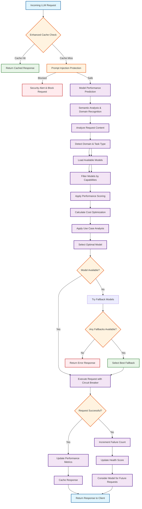

# LLM Router Request Evaluation Flow

This flowchart illustrates how the LLM Router intelligently evaluates incoming requests and routes them to the optimal LLM model based on multiple criteria.

## Detailed Flow Explanation

### 1. **Request Reception & Caching**
- **Enhanced Cache Check**: First checks if a similar request exists in semantic cache
- **Cache Hit**: Returns cached response immediately (fastest path)
- **Cache Miss**: Proceeds to full evaluation

### 2. **Security Validation**
- **Prompt Injection Protection**: Multi-layer defense against malicious inputs
- **Pattern Detection**: Identifies suspicious content patterns
- **Semantic Analysis**: Detects context manipulation attempts
- **Blocked Requests**: Security alerts and request blocking

### 3. **Intelligent Model Selection**
- **Performance Prediction**: ML-based prediction of model performance
- **Semantic Analysis**: Automatic domain recognition and task type detection
- **Request Analysis**: Determines task type, complexity, and requirements
- **Model Discovery**: Dynamically discovers available models from Google Cloud
- **Capability Filtering**: Matches model capabilities to request requirements

### 4. **Multi-Criteria Scoring**
- **Performance Scoring**: Latency, quality, success rate analysis
- **Cost Optimization**: Per-token pricing and budget considerations
- **Use Case Analysis**: Automatic assignment of optimal use cases
- **Health Monitoring**: Real-time model health and availability

### 5. **Execution & Fallback**
- **Circuit Breaker**: Prevents cascading failures
- **Primary Model**: Executes request with selected optimal model
- **Fallback Strategy**: Automatic fallback to alternative models
- **Error Handling**: Graceful degradation and error responses

### 6. **Performance Tracking**
- **Metrics Update**: Real-time performance data collection
- **Health Scoring**: Continuous model health evaluation
- **Response Caching**: Intelligent caching for future requests
- **Learning**: System improves routing decisions over time

## Key Decision Points

### **Cache Decision**
- **Semantic Similarity**: Uses advanced similarity algorithms
- **TTL Management**: Intelligent cache expiration
- **Priority Caching**: High-value responses prioritized

### **Security Decision**
- **Risk Assessment**: Multi-dimensional security scoring
- **Pattern Matching**: Regex and ML-based detection
- **Content Analysis**: Semantic and character pattern analysis

### **Model Selection Decision**
- **Capability Match**: Required vs. available capabilities
- **Performance Prediction**: ML-based latency and quality prediction
- **Cost Optimization**: Budget-aware model selection
- **Use Case Alignment**: Automatic use case detection and matching

### **Fallback Decision**
- **Availability Check**: Real-time model status
- **Performance Ranking**: Ordered fallback selection
- **Circuit Breaker**: Prevents repeated failures

## Performance Characteristics

- **Cache Hit Latency**: < 10ms (immediate response)
- **Full Evaluation**: 50-200ms (intelligent routing)
- **Model Execution**: 1-30s (depending on complexity)
- **Fallback Time**: +100-500ms (additional routing)

## Intelligence Features

1. **ML-Based Prediction**: Historical performance analysis
2. **Semantic Analysis**: Automatic domain recognition and content understanding
3. **Dynamic Discovery**: Automatic model detection
4. **Use Case Learning**: Continuous improvement
5. **Cost Optimization**: Real-time pricing integration
6. **Health Monitoring**: Proactive model management
7. **Security Intelligence**: Advanced threat detection

## Semantic Analysis Capabilities

### **Domain Recognition**
- **Financial**: Revenue analysis, budget planning, investment strategy
- **Technical**: Architecture design, system optimization, security implementation
- **Creative**: Content creation, marketing strategy, brand development
- **Research**: Market analysis, competitive intelligence, trend forecasting
- **Legal**: Contract review, compliance assessment, regulatory analysis
- **Healthcare**: Clinical research, medical analysis, patient care
- **Education**: Curriculum development, learning strategy, training design

### **Task Type Detection**
- **Complex Reasoning**: Analysis, evaluation, investigation, research
- **RAG Operations**: Search, retrieval, information discovery
- **Code Generation**: Programming, algorithm implementation, development
- **Fast Response**: Quick answers, urgent requests, simple queries
- **Strategic Planning**: Roadmap development, vision planning, goal setting

### **Complexity Assessment**
- **Content Analysis**: Length, structure, technical terminology
- **Domain Complexity**: Industry-specific complexity indicators
- **Task Complexity**: Pattern-based complexity detection
- **Capability Requirements**: Multimodal, RAG, code generation needs

This flowchart represents a **production-grade, enterprise-level LLM routing system** that automatically selects the optimal model for each request while maintaining security, performance, and cost efficiency.
